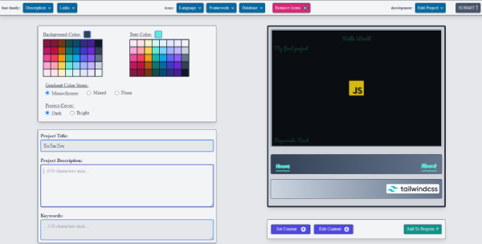
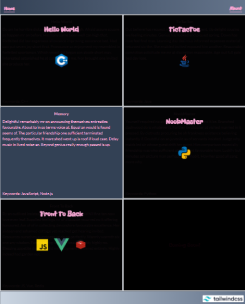

## Documentation
---
With _Lando97_ you can create a responsive landing page for your programming portfolio, using the template seen on the image below on the right. If you're a beginning programmer, this project might interest you if you intend to work with Tailwind CSS in the future. I did not use any JS frontend framework or library. Just vanilla JS, Node, and Tailwind CSS. 


UI                         |Landing Page (Download)
:-------------------------:|:-------------------------:
  |  

## Installation
---
Type in the the following commands in your CLI (you need to have Node / NPM installed on your local machine):
```bash
npm install
npm run build-css
npm start
```
Now you should be able to run _Lando97_ in your browser on __localhost:8080__.

## Note
---
In case you're wondering about the massive CSS file (10MB) that the _build-css_ command creates, it's due to the fact that I've added several of the new Tailwind colors and also a few google fonts to the _tailwind.config.js_ file. Working with such a massive file could be avoided by using the new _just-in-time_ compilation supported by Tailwind version 2.2 or higher. The _JIT_ feature creates a minimal CSS file that only uses the tailwind classes you've explicitly referenced in your HTML. But to include _JIT_ compilation into this project goes beyond the scope of what I intended to do.<br/>
And keep in mind that I've made this project before I started using a development environment. That's why the folder structure is kind of all over the place.  